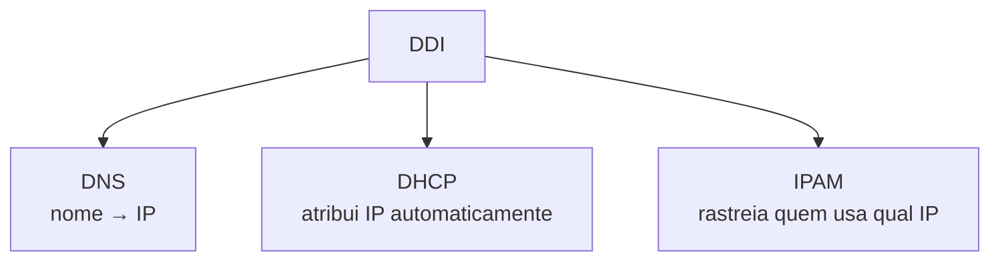

# Aula 0 — Definição e Importância do DDI

> [!info] Resumo
> **DDI** é o termo coletivo para **três serviços de rede essenciais**: **DNS**, **DHCP** e **IPAM**. Juntos, eles cobrem três tarefas comuns do administrador de rede: **traduzir nomes em IPs**, **atribuir IPs automaticamente** e **rastrear quem usa qual IP**.

---

## 🧩 O que é DDI?

**DDI** = **D**NS + **D**HCP + **I**PAM

| Sigla | Função |
|-------|--------|
| **DNS** | Traduz **nomes** em **endereços IP** |
| **DHCP** | Atribui endereços IP **automaticamente** |
| **IPAM** | Mantém o **controle de quem tem qual IP** |

> [!note]
> São **três tarefas comuns** que administradores de rede executam no dia a dia.

---

## 📥 O problema do dia a dia: atribuir IPs

- Administradores recebem pedidos como: *"Preciso que você atribua alguns IPs a estes dispositivos!"*
- **Todo dispositivo precisa de um IP** para conectar à rede.
- Há **duas formas** de um dispositivo receber um IP:
  1. **Manual** → atribuído por um administrador.
  2. **Automático** → via protocolo como o **DHCP**.

> [!note]
> Os detalhes de cada método (vantagens e desvantagens) serão vistos em aulas posteriores.

---

## 🔤 A necessidade de tradução

- Usuários **não conseguem lembrar os IPs brutos** dos sites que querem visitar.
- Introduzir uma **camada de tradução fácil de entender** — o **DNS** — melhora muito a experiência.

---

## ⚠️ Por que o DDI é tão importante

> [!important] Impacto de cada serviço
> Profissionais experientes sabem o quanto o DDI é crítico. Veja o que acontece **sem cada um**:

- **Sem DNS:**
  - A rede pode até **funcionar parcialmente**...
  - ...mas **muitas ou todas as aplicações deixam de funcionar**.

- **Sem DHCP:**
  - A **maioria dos dispositivos** (e alguns servidores) **não conseguem entrar na rede**.
  - Dispositivos **já online** também **se desconectam** se o DHCP ficar indisponível por muito tempo.

- **Sem IPAM:**
  - Os **usuários ainda conseguem trabalhar**.
  - Mas fica **muito mais difícil** para help desk, operadores e administradores **rastrear quem usa o quê**.
  - Isso **complica muito** a resolução de problemas e a gestão da rede.

> [!tip] Quem é afetado por quê
> **DNS e DHCP** afetam **diretamente os usuários**.
> **IPAM** é mais importante para os **administradores** (gestão e troubleshooting).

---

## 🔑 Glossário rápido

- **DDI** — termo coletivo para DNS + DHCP + IPAM.
- **DNS** — traduz nomes em endereços IP.
- **DHCP** — atribui endereços IP automaticamente.
- **IPAM** — rastreia/gerencia quem tem qual endereço IP.
- **Atribuição manual** — IP definido por um administrador.
- **Atribuição automática** — IP entregue via protocolo (DHCP).

---

## ✅ Pontos de revisão

- [ ] O que significa a sigla **DDI** e quais serviços ela engloba?
- [ ] Qual é a função específica de DNS, DHCP e IPAM?
- [ ] Quais são as duas formas de um dispositivo receber um IP?
- [ ] O que acontece com a rede **sem DNS**? E **sem DHCP**?
- [ ] Por que o **IPAM** importa mais para administradores do que para usuários?

---

## 🔗 Notas relacionadas

- [[DDI Associate - Índice]]
- Próxima aula: [[01 - Historia do DNS]]
