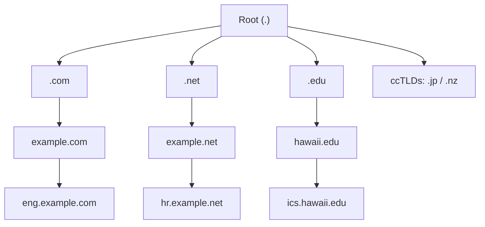

# Aula 1 — História do Domain Name System (DNS)

> [!info] Resumo
> O DNS surgiu para resolver um problema simples: humanos não conseguem decorar endereços IP. A solução evoluiu de um único arquivo central (`hosts.txt`) para um sistema **distribuído e hierárquico** criado em 1983 por Paul Mockapetris — cujo design fundamental permanece praticamente inalterado até hoje.

---

## 🕰️ Antes do DNS: a era do `hosts.txt`

- No início da internet (quando ainda era a **ARPANET**), **não existia DNS** — só endereços IP.
- Para acessar outro computador, era preciso conhecer seu **IP** diretamente.
- Como o cérebro humano não foi feito para memorizar sequências numéricas, alguém de **Stanford** teve a ideia de criar uma "lista telefônica" para computadores → nasceu o arquivo **`hosts.txt`**.
- O `hosts.txt` mapeava **nome → endereço IP**.

> [!warning] O problema de escala
> Cada mudança no `hosts.txt` exigia contatar uma pessoa para editar o arquivo central e **todos** precisavam baixar a nova cópia.
> Era como **reimprimir a lista telefônica inteira a cada alteração**. Com o crescimento da ARPANET, esse método se tornou insustentável.

---

## 💡 1983–1987: O nascimento do DNS

| Ano | Marco |
|-----|-------|
| **1983** | **Paul Mockapetris** (Internet Hall of Fame) propõe **descentralizar** o sistema de nomes → cria o **Domain Name System (DNS)** |
| **1984** | Conceito implementado no software **BIND** (*Berkeley Internet Name Domain*) — ainda hoje um dos softwares DNS mais populares |
| **1987** | O design do DNS é formalizado nos padrões **RFC 1034** e **RFC 1035** |

> [!tip] A ideia central
> Em vez de armazenar tudo em **um lugar central**, as entradas ficam **espalhadas pelo mundo**. Isso é a descentralização que define o DNS.

A especificação do DNS **mudou muito pouco** desde esses documentos originais.

---

## 📜 O que é um RFC?

- **RFC = Request for Comments** ("Pedido de Comentários").
- Apesar do nome, é na prática uma **especificação de design / padrão de engenharia** seguido por todos que projetam tecnologia para a internet.
- É um padrão **aberto e construído pela comunidade**.
- Qualquer pessoa pode contribuir: basta se inscrever na **IETF** (*Internet Engineering Task Force*) e participar das listas de e-mail. Se a comunidade concordar com sua ideia, ela pode entrar no padrão.
- Todo mundo **referencia os RFCs** ao escrever software que se comunica em rede.

---

## 🌳 A "árvore invertida" do DNS

A estrutura do DNS é desenhada como uma **árvore de cabeça para baixo** — a **raiz (root)** fica no **topo**, e os ramos descem até as folhas.

**Níveis da hierarquia (de cima para baixo):**

1. **Root** — a raiz do DNS (topo).
2. **TLD (Top-Level Domain)** — domínios de topo: `.com`, `.net`, `.edu`.
   - **ccTLD (country code TLD)** — códigos de país: `.jp` (Japão), `.nz` (Nova Zelândia).
3. **Second-Level Domain** — ex.: `example.com`, `hawaii.edu`.
4. **Subdomínios** — ex.: `eng.example.com`, `ics.hawaii.edu`.
5. ...e pode continuar descendo por **muitos níveis**.

> [!note] Por que isso importa
> A hierarquia permite uma **base de dados distribuída** — não há um repositório central gigante. Cada organização **gerencia seu próprio espaço de nomes**.
> Ex.: a Universidade do Havaí administra `hawaii.edu` sozinha e pode criar `ftp.hawaii.edu` **sem autoridade central**. Isso é o que permite o DNS **escalar** junto com o crescimento exponencial da internet.

---

## 🌐 O DNS hoje

- Ainda é **baseado nas specs originais de 1987**.
- Roda sobre as mesmas duas portas:
  - **UDP 53** → envio de **pacotes pequenos**.
  - **TCP 53** → envio de **pacotes grandes**.

> [!important] Mito comum sobre o TCP
> É **falso** que o TCP seja opcional ou que tenha sido adicionado depois. **O TCP sempre fez parte da definição do DNS**. Você precisa de **ambos** (UDP e TCP) para operar DNS.

- O **arquivo `hosts`** ainda existe nos dispositivos atuais e funciona como um **override local do DNS**:
  - **Unix/Linux:** `/etc/hosts`
  - **Windows:** `C:\windows\system32\...`
- Se um nome estiver no arquivo `hosts`, a resolução usa **esse arquivo no lugar do DNS**.

> [!tip] Relevância prática
> O arquivo `hosts` será importante mais adiante em **troubleshooting** e no estudo do **processo de resolução DNS**.

---

## 🔑 Glossário rápido

- **DNS** — Domain Name System; traduz nomes em endereços IP de forma distribuída.
- **`hosts.txt` / `hosts`** — arquivo de mapeamento nome→IP; hoje atua como override local.
- **BIND** — Berkeley Internet Name Domain; software de DNS criado em 1984.
- **RFC** — Request for Comments; especificação/padrão da internet.
- **IETF** — Internet Engineering Task Force; comunidade que mantém os padrões.
- **TLD** — Top-Level Domain (`.com`, `.net`, `.edu`).
- **ccTLD** — country code TLD (`.jp`, `.nz`).
- **Second-Level Domain** — ex.: `example.com`.
- **Subdomínio** — ex.: `eng.example.com`.

---

## ✅ Pontos de revisão

- [ ] Por que o `hosts.txt` não escalava?
- [ ] Quem criou o DNS, em que ano, e em quais RFCs ele foi formalizado?
- [ ] O que significa o DNS ser uma base de dados **distribuída**?
- [ ] Quais portas o DNS usa e por que **ambas** (UDP e TCP) são necessárias?
- [ ] Onde fica o arquivo `hosts` no Linux e no Windows, e qual seu papel?

---

## 🔗 Notas relacionadas

- [[DDI Associate]]
- Próxima aula: _(a definir conforme você enviar)_
