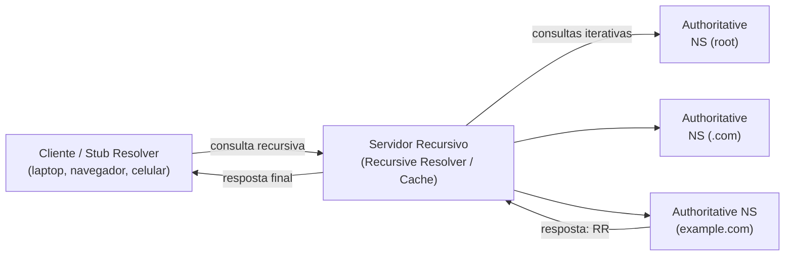

# Aula 3 — Terminologia e Definições do DNS

> [!info] Resumo
> Esta aula apresenta o vocabulário essencial do DNS. O cenário base: um **cliente (laptop)** pergunta a um **servidor DNS recursivo** qual o endereço IPv6 de `xyz.example.com`. Esse servidor central conversa com **outros servidores DNS** até encontrar a resposta. Para entender esse processo, precisamos dominar os termos abaixo.

---

## 🗺️ O cenário base

- **Cliente (laptop)** → quem executa a consulta DNS.
- **Servidor DNS central (recursivo)** → recebe a pergunta do cliente e conversa com outros servidores.
- **Outros servidores DNS** → consultados até a resposta ser encontrada.

**Pergunta do exemplo:** *"Qual é o endereço IPv6 do domínio `xyz.example.com`?"*

---

## 📛 FQDN — Fully Qualified Domain Name

- É o **nome de domínio completo** de um host específico na internet.
- Exemplo: `xyz.example.com` é um FQDN.
- Possui **duas partes**:
  - **Host name** → `xyz`
  - **Domain name** → `example.com`

---

## 💻 Cliente e Stub Resolver

- Um **cliente** faz perguntas simples, como: *"Qual o IPv4 de `www.google.com`?"*
- O cliente **não consegue seguir os referrals** (encaminhamentos) dados por outros servidores — ele **não sabe "andar pela árvore"** sozinho.
- Por isso, ele depende de um **servidor recursivo** para rastrear a resposta.
- **Stub resolver** = o trecho de software que envia essas consultas simples.
  - Normalmente **embutido no Sistema Operacional** (Windows, Linux já vêm com um).
  - Atende a todos os componentes do SO que precisam resolver nomes.

> [!note] O que conta como "cliente" neste curso
> Qualquer **aplicação ou dispositivo que opera com um stub resolver**: navegadores, laptops e celulares — todos são clientes.

---

## 🔁 Consulta Recursiva (Recursive Query)

- Iniciada pelo **cliente** em direção a um servidor DNS que **suporta recursão**.
- Essência: *"Preciso da resposta. Se você não tiver, pergunte aos outros até encontrá-la."*
- **Por padrão, todos os clientes fazem consultas recursivas**, porque não conseguem rastrear as respostas sozinhos (o tal "walking the tree").

> [!tip] Metáfora da biblioteca 📚
> Você pede a um bibliotecário o livro *"The Shining"*. Ele pode precisar perguntar a outro bibliotecário, que pergunta a outro... No fim, ele volta **com o livro** ou diz *"Desculpe, não temos esse título."* Isso é uma **consulta recursiva**.

---

## ↪️ Consulta Iterativa (Iterative Query)

- Normalmente iniciada por **servidores DNS** em direção a **outros servidores DNS**.
- **Diferença-chave** em relação à recursiva: a consulta iterativa envolve **referrals (encaminhamentos)**.
- **DNS referral** = quando um servidor DNS direciona quem perguntou para **consultar outro servidor**.

> [!tip] Metáfora da biblioteca (continuação)
> Se a consulta **recursiva** é o visitante pedindo o livro ao bibliotecário, a consulta **iterativa** é o bibliotecário pedindo ajuda a **outros bibliotecários**.

---

## 🧭 Recursive Name Server (Recursive Resolver)

- Projetado para **aceitar consultas recursivas**.
- Atende essas consultas executando **consultas iterativas nos bastidores** até achar a resposta.
- Com o tempo, acumula um **cache rico de respostas** → por isso também é chamado de **caching name server**.

> [!tip] Na metáfora
> É **o bibliotecário** a quem você pediu o livro — quem faz todo o trabalho pesado de rastrear a resposta.

---

## 📚 Authoritative Name Server

- É a **fonte definitiva** das respostas.
- Só pode responder com base no que está **em seu próprio banco de dados / arquivos**.
- Exemplo: um servidor autoritativo para `example.com` **só** responde sobre `example.com`. Se perguntarem sobre `hawaii.edu`, ele **não responde**.

> [!tip] Na metáfora
> São os **outros bibliotecários** que forneceram os referrals — os que têm o conhecimento/recurso específico para responder.

> [!note] Por que essa divisão importa
> Cada servidor gerencia sua **própria zona de dados**. Essa **divisão de responsabilidades** é fundamental para o DNS **escalar** e suportar o volume enorme de consultas da internet.

---

## 🗂️ RR — Resource Record

- Um **Resource Record** é uma informação que se quer extrair do DNS — como **uma entrada na lista telefônica**.
- Todos os RRs têm a mesma estrutura básica, com **3 partes**:

| Parte | No exemplo `xyz.example.com` |
|-------|------------------------------|
| **Label** (rótulo) | `xyz.example.com` |
| **Type** (tipo) | `AAAA` (endereços IPv6) |
| **Information** (informação) | `fe00:dead::beef` |

> [!note]
> No exemplo, o tipo não estava visível, mas seria **AAAA** (registro de IPv6). Os tipos de RR serão detalhados em outras aulas.

---

## 🌐 Zone (Zona)

- Uma **zona** é uma **coleção de Resource Records** que compartilham o **mesmo sufixo de nome de domínio**.
- Reside em **servidores autoritativos**, como **arquivo de texto** ou dentro de um **banco de dados**.
- Tipicamente representa **um único domínio** (ex.: `example.com`)...
- ...mas uma única zona **pode abranger múltiplos domínios** (ex.: `example.com` e `deeper.example.com`).

> [!tip] Forma simples de pensar
> Uma zona é um grupo de RRs que compartilham o mesmo **"sobrenome de família"** e convivem no mesmo espaço.

---

## 🧩 Juntando tudo (o processo básico)

1. O **cliente / stub resolver** faz uma **consulta recursiva**.
2. O **recursive resolver** executa **consultas iterativas** (seguindo **referrals**) aos **servidores autoritativos**.
3. Os autoritativos respondem com o **Resource Record** da sua **zona**.
4. O recursivo entrega a **resposta final** ao cliente (e guarda em **cache**).

> [!note]
> Este é o processo **básico** — os detalhes intrincados da resolução de nomes serão aprofundados em outra aula.

---

## 🔑 Glossário rápido

- **FQDN** — nome de domínio completo (host name + domain name). Ex.: `xyz.example.com`.
- **Stub Resolver** — software (no SO) que envia consultas DNS simples.
- **Cliente** — app/dispositivo que opera com stub resolver (navegador, laptop, celular).
- **Consulta Recursiva** — "ache a resposta para mim, pergunte aos outros se precisar".
- **Consulta Iterativa** — entre servidores; envolve **referrals**.
- **Referral** — encaminhamento de um servidor para outro.
- **Recursive Resolver / Caching Name Server** — aceita consultas recursivas e mantém cache.
- **Authoritative Name Server** — fonte definitiva; responde só pela sua zona.
- **RR (Resource Record)** — entrada do DNS (label + type + information).
- **AAAA** — tipo de RR para endereços IPv6.
- **Zone (Zona)** — coleção de RRs com o mesmo sufixo de domínio.

---

## ✅ Pontos de revisão

- [ ] Quais são as duas partes de um FQDN? Identifique-as em `xyz.example.com`.
- [ ] Qual a diferença entre **consulta recursiva** e **consulta iterativa**?
- [ ] O que é um **referral** e quem normalmente o utiliza?
- [ ] Por que o recursive resolver também é chamado de **caching name server**?
- [ ] Por que um servidor autoritativo para `example.com` não responde sobre `hawaii.edu`?
- [ ] Quais são as 3 partes de um Resource Record? Dê o exemplo da aula.
- [ ] O que é uma **zona** e onde ela reside?

---

## 🔗 Notas relacionadas

- [[DDI Associate - Índice]]
- Aula anterior: [[02 - Importancia do DNS]]
- Próxima aula: _(a definir conforme você enviar)_
