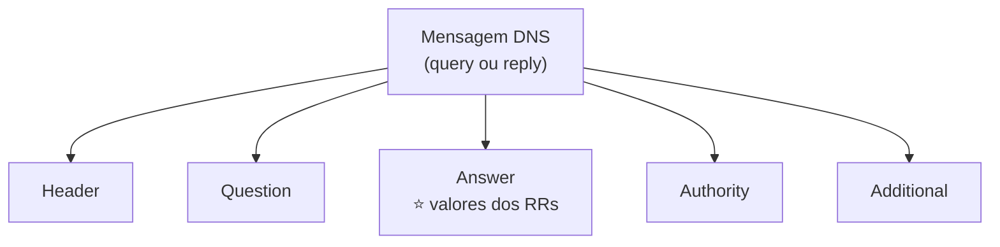

# Aula 6 — Anatomia de uma Mensagem DNS

> [!info] Resumo
> Existem **dois tipos** de mensagens DNS — **queries (consultas)** e **replies (respostas)** — e ambas usam **o mesmo formato**. Cada mensagem tem um **header** e **quatro seções**: question, answer, authority e additional.

---

## ✉️ Tipos de mensagem DNS

- **Query** (consulta)
- **Reply** (resposta)

Ambas compartilham **exatamente o mesmo formato**.

---

## 🧱 As 5 partes principais (RFC 1035, Seção 4.1)

Cada mensagem é composta por **um header + quatro seções**:

| Parte | Função |
|-------|--------|
| **Header** | Cabeçalho com metadados da mensagem |
| **Question** | A pergunta sendo feita |
| **Answer** | Onde aparecem os **valores dos Resource Records** |
| **Authority** | Informações sobre servidores autoritativos |
| **Additional** | Informações adicionais/complementares |

> [!tip] Onde focar
> O foco principal é a **seção Answer**, pois é nela que aparecem os **valores dos Resource Records (RR)** — o que normalmente queremos extrair de uma consulta.

---

## 🔑 Glossário rápido

- **Query / Reply** — os dois tipos de mensagem DNS (mesmo formato).
- **Header** — cabeçalho da mensagem.
- **Question** — a pergunta da consulta.
- **Answer** — seção com os valores dos Resource Records.
- **Authority** — dados sobre servidores autoritativos.
- **Additional** — informações complementares.
- **RFC 1035** — documento que define o formato da mensagem DNS (Seção 4.1).

---

## ✅ Pontos de revisão

- [ ] Quais são os dois tipos de mensagem DNS e o que têm em comum?
- [ ] Quais são as cinco partes de uma mensagem DNS?
- [ ] Em qual seção aparecem os valores dos Resource Records?
- [ ] Qual RFC define o formato da mensagem DNS?

---

## 🔗 Notas relacionadas

- [[DDI Associate - Índice]]
- Aula anterior: [[05 - Dicas e Recomendacoes de Lookup]]
- Próxima aula: [[07 - Nomes Legais de DNS e IDN]]
- Relacionado: [[03 - Terminologia e Definicoes do DNS]] (Resource Records)
