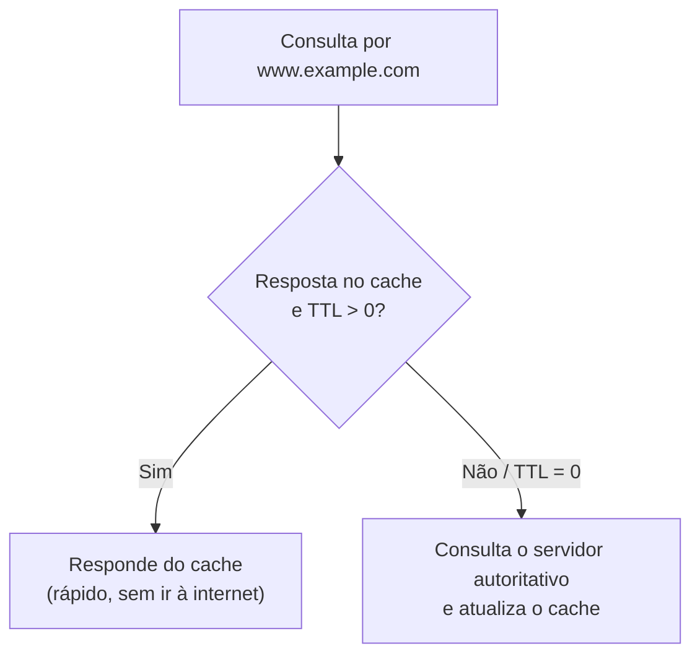

# Aula 8 — RRset (Resource Record Set)

> [!info] Resumo
> Um **RRset** é simplesmente uma **coleção de Resource Records com o mesmo nome**. É muito comum: se você consulta um nome e recebe duas ou três respostas, isso é um RRset. Esta aula também introduz o **DNS Round-Robin** (distribuição primitiva de carga) e o **TTL** (quanto tempo um resolver pode guardar a resposta em cache).

---

## 📦 O que é um RRset

- **RRset = Resource Record Set** → uma **coleção de Resource Records com o mesmo nome**.
- É um conceito **muito comum**: ao buscar um nome e receber **2 ou 3 respostas**, você obteve um **RRset**.

**Exemplo da aula:** três registros **A** para o nome `www.example.com`.
- Ao consultar `www.example.com`, o cliente recebe **as três respostas possíveis** (o RRset).
- O **software cliente** então **escolhe qual usar**.

> [!note] Tipos que costumam retornar RRsets
> **A**, **NS**, **MX** e **SRV** são tipos de registro que comumente retornam RRsets.

---

## 🔄 DNS Round-Robin

- Comportamento comum de um servidor DNS: **alternar a ordem do RRset a cada requisição**.
- Isso é chamado de **DNS Round-Robin**.
- Objetivo: alcançar uma **forma primitiva de distribuição de carga (load distribution)**.

> [!warning] Limitação atual
> A maioria dos **clientes modernos é "esperta" o suficiente** para **ler o RRset inteiro** e **fazer sua própria seleção** — o que reduz a eficácia do round-robin como mecanismo de balanceamento.

---

## ⏲️ TTL — Time To Live

- O **TTL** é o **temporizador** que diz aos **servidores recursivos** por **quanto tempo** podem manter aquela resposta em **cache**.
- Quando o TTL chega a **zero**, o servidor recursivo precisa **voltar ao servidor autoritativo** para obter a resposta novamente.
- Propósito: **aliviar a carga** tanto dos servidores **recursivos** quanto dos **autoritativos**.

> [!example] Exemplo: TTL = 1800 s (meia hora)
> 1. Alguém consulta `www.example.com`.
> 2. O servidor recursivo **memoriza a resposta por 30 minutos**.
> 3. Se outro usuário/dispositivo pedir o **mesmo nome** dentro desse período, o recursivo **responde do cache** — sem precisar ir à internet perguntar de novo ao autoritativo.

---

## 🔑 Glossário rápido

- **RRset** — coleção de Resource Records com o **mesmo nome**.
- **Registros que retornam RRset** — A, NS, MX, SRV.
- **DNS Round-Robin** — alternância da ordem do RRset para distribuir carga.
- **Load distribution** — distribuição de carga (aqui, primitiva).
- **TTL (Time To Live)** — tempo que um recursivo pode manter a resposta em cache.
- **Cache** — armazenamento temporário das respostas para aliviar a rede.

---

## ✅ Pontos de revisão

- [ ] Defina RRset em uma frase. Quem escolhe qual registro usar?
- [ ] Quais tipos de registro comumente retornam RRsets?
- [ ] O que é DNS Round-Robin e qual sua limitação com clientes modernos?
- [ ] O que o TTL controla e o que acontece quando chega a zero?
- [ ] No exemplo de TTL = 1800s, o que acontece se outro usuário consultar o mesmo nome em 10 minutos?

---

## 🔗 Notas relacionadas

- [[DDI Associate - Índice]]
- Aula anterior: [[07 - Nomes Legais de DNS e IDN]]
- Próxima aula: _(a definir conforme você enviar)_
- Relacionado: [[03 - Terminologia e Definicoes do DNS]] (Resource Records, cache, recursivo/autoritativo)
