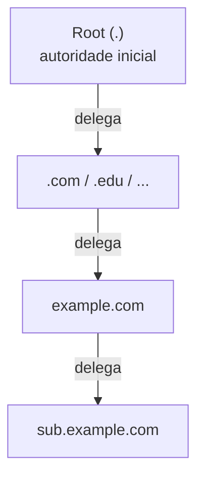

# Aula 11 — Dados Autoritativos (Authoritative Data)

> [!info] Resumo
> Antes de falar sobre **root servers**, é preciso entender os **dados autoritativos**. O DNS é uma rede **descentralizada**: a autoridade **não fica concentrada** em um único lugar — ela **começa na raiz (root)** e é **delegada** progressivamente a outras entidades. Cada pedaço dessa autoridade é um conjunto de **dados autoritativos**, implementado como uma **zona autoritativa**.

---

## 🌐 Autoridade descentralizada

- O DNS opera como uma **rede descentralizada**, e **não** como uma entidade única e centralizada.
- A autoridade **não está concentrada** em um só local.
- Ela **começa na raiz (root)** e se **estende** para os mais variados cantos da internet.

---

## 🪜 Delegação de autoridade

- A autoridade é **gradualmente "delegada"** do nível root para outras entidades.
- Pense nesse processo como **quebrar a autoridade em pedaços menores**, com **cada domínio detendo o seu próprio pedaço**.

---

## 🧩 Dados autoritativos e zonas

- Cada segmento de autoridade é chamado de **"authoritative data" (dados autoritativos)**.
- Normalmente é implementado na forma de uma **zona autoritativa (authoritative zone)**.

> [!tip] Visualização
> Imagine **cada círculo na tela** como uma **zona autoritativa** — um pedaço independente de autoridade dentro da hierarquia do DNS.

---

## 🔑 Glossário rápido

- **Dados autoritativos (authoritative data)** — um segmento de autoridade dentro do DNS.
- **Delegação** — repasse de autoridade do nível superior (root) para entidades menores.
- **Zona autoritativa** — forma como os dados autoritativos são implementados.
- **Root** — ponto inicial da autoridade no DNS.
- **Descentralização** — autoridade distribuída, não concentrada.

---

## ✅ Pontos de revisão

- [ ] Por que se diz que o DNS é descentralizado?
- [ ] Onde começa a autoridade no DNS e como ela se espalha?
- [ ] O que significa "delegar" autoridade?
- [ ] O que são "dados autoritativos" e em que forma são normalmente implementados?

---

## 🔗 Notas relacionadas

- [[DDI Associate - Índice]]
- Aula anterior: [[10 - Formato de Endereco IPv6 e Importancia do DNS]]
- Próxima aula: _(a definir conforme você enviar)_
- Relacionado: [[01 - Historia do DNS]] (base de dados distribuída) · [[03 - Terminologia e Definicoes do DNS]] (servidor autoritativo, zona)
