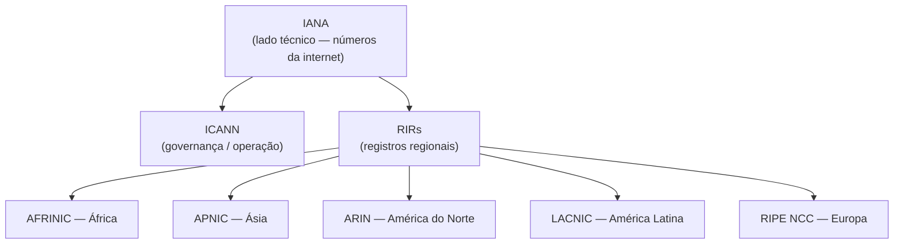

# Aula 13 — Autoridades Operacionais do DNS

> [!info] Resumo
> Quem controla os nomes de domínio da internet? De forma simplificada: a **IANA** cuida do **lado técnico** (todos os números da internet, incluindo gestão do DNS), a **ICANN** cuida do **lado operacional/governança**, e abaixo da IANA estão os **RIRs (Regional Internet Registries)**, que distribuem blocos de endereços por região.

---

## 🏛️ IANA — Internet Assigned Numbers Authority

- Organização que **gerencia todos os números relacionados à internet**:
  - Alocação de **endereços IP**
  - Números de **algoritmos e opções**
  - Números de **protocolos**
  - **Facilita a gestão do DNS** como parte de suas responsabilidades
- Quer um novo **bloco de IPv6** ou registrar uma nova **opção de DHCP**? Você obtém isso da **IANA**.
- Organiza os **operadores dos root name servers** e os esforços de **delegação** do root para os **TLDs** e **ccTLDs**.

> [!note] Curiosidade
> A **IANA é literalmente mais antiga que a própria internet!**

---

## 🌐 ICANN — Internet Corporation for Assigned Names and Numbers

- Uma **organização sem fins lucrativos**, baseada em **voluntários**, da comunidade global da internet.
- **Independente** de quaisquer órgãos políticos ou governamentais.
- **Opera a internet** (no sentido de governança).

> [!tip] Como diferenciar IANA × ICANN
> Pense na **IANA como o lado técnico** e na **ICANN como o lado operacional / de governança**.
> Juntas, controlam os **números e nomes** da internet — DNS incluído.

---

## 🗺️ RIRs — Regional Internet Registries

Abaixo da IANA estão os **Regional Internet Registries**, organizados por região:

| RIR | Região |
|-----|--------|
| **AFRINIC** | África |
| **APNIC** | Ásia |
| **ARIN** | América do Norte |
| **LACNIC** | América Latina |
| **RIPE NCC** | Europa |

> [!note]
> A menos que você **opere um TLD** ou precise **solicitar novos blocos de endereçamento**, é **improvável** que você lide diretamente com os RIRs.

---

## 🧩 Hierarquia das autoridades

---

## 🔑 Glossário rápido

- **IANA** — Internet Assigned Numbers Authority; lado **técnico**; gerencia números (IPs, protocolos, opções de DHCP) e facilita o DNS.
- **ICANN** — Internet Corporation for Assigned Names and Numbers; lado **operacional/governança**; sem fins lucrativos e independente.
- **RIR (Regional Internet Registry)** — distribui blocos de endereços por região.
- **AFRINIC / APNIC / ARIN / LACNIC / RIPE NCC** — os RIRs por região.

---

## ✅ Pontos de revisão

- [ ] O que a IANA gerencia? Cite ao menos três tipos de "números".
- [ ] Qual a diferença prática entre IANA (técnico) e ICANN (governança)?
- [ ] Onde você obteria um novo bloco IPv6 ou uma nova opção de DHCP?
- [ ] Quais são os cinco RIRs e suas regiões?
- [ ] Em que situações você lidaria diretamente com um RIR?

---

## 🔗 Notas relacionadas

- [[DDI Associate - Índice]]
- Aula anterior: [[12 - Root Name Servers e Enderecos IP]]
- Próxima aula: _(a definir conforme você enviar)_
- Relacionado: [[11 - Dados Autoritativos]] (delegação) · [[12 - Root Name Servers e Enderecos IP]] (operadores dos root servers, TLDs)
